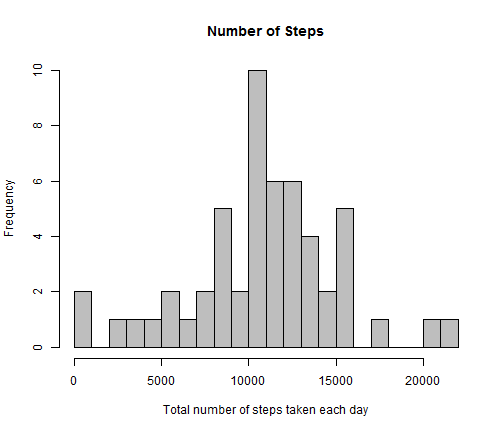
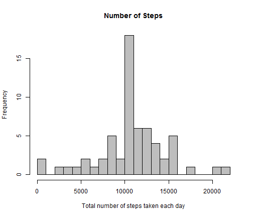

# Reproducible Research: Assignment 1
========================================================


## Loading and preprocessing the data
  Excluding NA

```r
echo = TRUE
setwd("C:/Users/Cvetanka/Desktop/Cvetanka/Coursera/Rep research")
activity <- read.csv("./activity.csv")
valid_data <- activity[which(activity$steps !="NA"),]
```
## What is mean total number of steps taken per day?


```r
total_steps <- aggregate(steps~date, valid_data, sum)
mean(total_steps$steps)
```

```
## [1] 10766.19
```

```r
median(total_steps$steps)
```

```
## [1] 10765
```


```r
hist(total_steps$steps, main="Number of Steps", xlab= "Total number of steps taken each day", col = "gray",breaks=30)
```

 

## What is the average daily activity pattern?


```r
daily_average <- aggregate(steps~interval, valid_data, mean)
names(daily_average)[2] <- "AverageSteps" 
```


```r
plot(daily_average$interval, daily_average$AverageSteps, type = "l", col = "gray", main = "Average daily activity pattern", xlab="5-minute interval", ylab="Average number of steps taken")
```

 

## Imputing missing values
the total number of missing values is equal on the difference between the length of the activity and valid_data

```r
nrow(activity)-nrow(valid_data)
```

```
## [1] 2304
```
replacing missing values with the averages per interval

It could be done with the package gam and the function na.gam.replace. It replaces NA values with the mean of the non missing entries.

install.packages("gam", repo="http://cran.rstudio.com/")
library(gam)

activity1 <- na.gam.replace(activity)


or the same can be achieved replacing NA with the average value of the steps that has been previously calculated:


```r
activity$steps[is.na(activity$steps)] <- daily_average$AverageSteps
```

Make a histogram of the total number of steps taken each day and calculate and report the mean and median total number of
steps taken per day. 

```r
AllSteps <- aggregate(steps~date, activity, sum)
```


```r
hist(AllSteps$steps, main="Number of Steps", xlab = "Total number of steps taken each day", col = "gray", breaks = 30)
```

 

```r
mean(AllSteps$steps)
```

```
## [1] 10766.19
```

```r
median(AllSteps$steps)
```

```
## [1] 10766.19
```
The difference in the value of the variable "steps" with NA replaced with the average values of the other entries and without NA

```r
sum(AllSteps$steps) - sum(total_steps$steps)
```

```
## [1] 86129.51
```

## Are there differences in activity patterns between weekdays and weekends?


```r
library(lattice)
days <- weekdays(as.Date(activity$date))
activity$days <- ifelse(days == "Saturday" | days == "Sunday", "Weekend", "Weekday")
NewSteps <- aggregate(steps~interval+days, activity, mean)
```


```r
xyplot(steps~interval | days,NewSteps, type="l", layout=c(1,2),xlab="Interval",ylab = "Number of steps")
```

 

